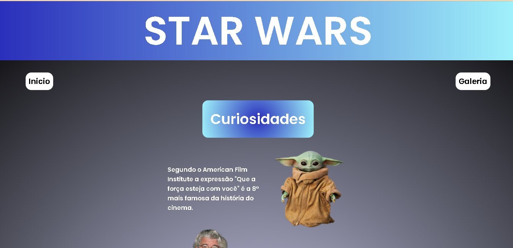
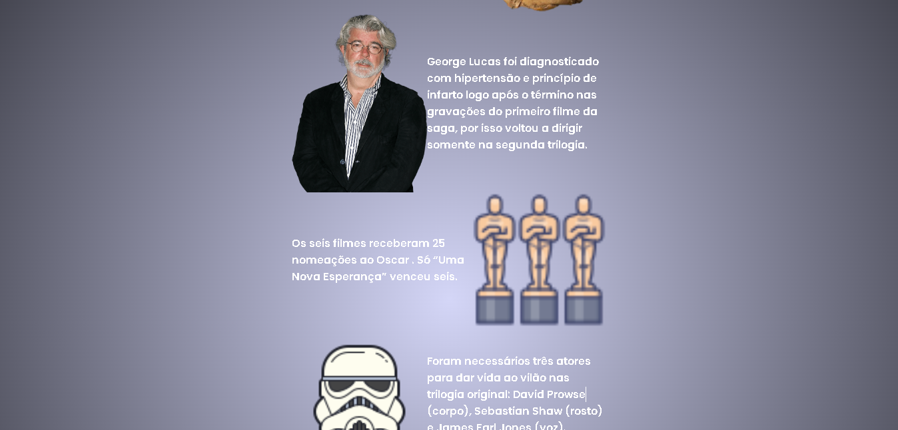
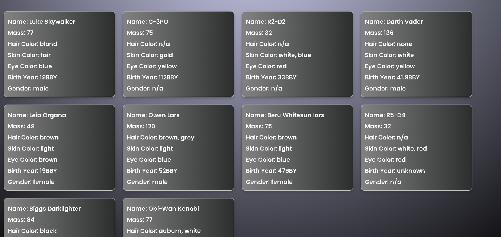

# Desafio fábrica de software
### Workshop de front-end 2023.2 - Consumindo a API de STAR WARS

## Tecnologias usadas

- HTML
- CSS
- JavaScript

Criado por [Lígia Kaylanne](https://www.linkedin.com/in/l%C3%ADgia-kaylanne-9b7947240/)